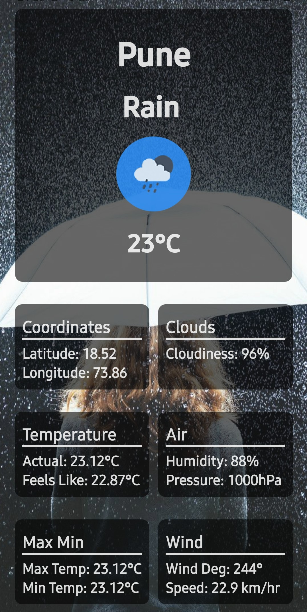

# Cross Platform Weather App Made with React Native
### You can search for weather based on any City Name
### Api Used: Openweathermap Api

## Screenshots
   

### Dynmaic Backgrounds and Weather Icon based on Weather Conditions

## Available Scripts

In the project directory, you can run:

### `yarn start` or you can directly run `expo start`

but first make sure you install the dependencies using 

### `yarn install` or, if you prefer `npm install`
